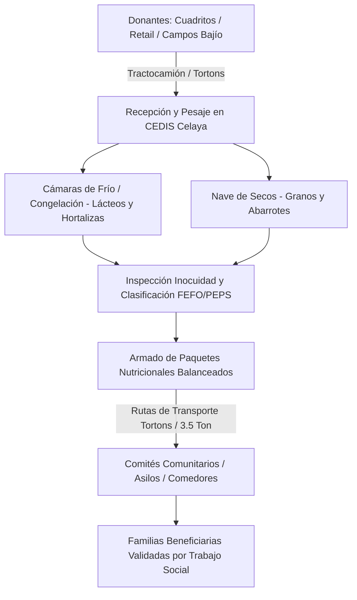
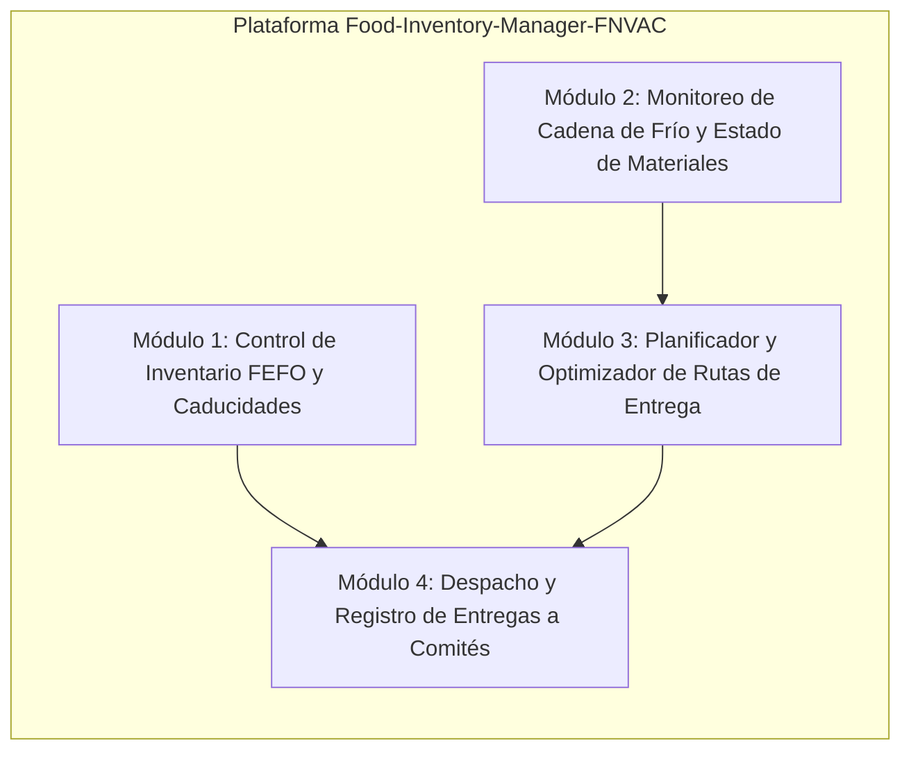

# Contexto del Proyecto: Food-Inventory-Manager-FNVAC

**Equipo:** Equipo de Desarrollo de Software • Banco de Alimentos  
**Institución:** Tecnológico de Monterrey  
**Fecha de consolidación y actualización:** Septiembre de 2026  

---

## 1. Perfil Institucional y Legal de la Organización Socio Formadora (OSF)

* **Razón Social:** Fundación Nutrición y Vida, A.C. (FNVAC)
* **RFC:** `FNV010101AAA`
* **Giro:** Banco de alimentos sin fines de lucro con **23 años de trayectoria activa** (fundada formalmente en 2001, operaciones activas desde 2003 en Celaya, Gto).
* **Estatus Institucional:** Donataria autorizada ante el SAT (ratificada en el Anexo 14 de la RMF) y acreditada con el nivel óptimo de los Estándares de Institucionalidad y Transparencia (AIT) de CEMEFI.
* **Liderazgo y Origen:** Iniciativa impulsada por el empresariado agroindustrial del Bajío (Grupo Cuadritos Biotek) al contrastar la riqueza lechera y agroindustrial del Bajío con los altos índices de marginación y desnutrición infantil circundantes.
* **Sede Central y CEDIS:** Celaya, Guanajuato, México.

---

## 2. Infraestructura y Escala Operativa

### Instalaciones (CEDIS Celaya)
* **Andenes industriales:** Carga y descarga simultánea para tractocamiones y tortons.
* **Cámaras frías y de congelación:** Almacenamiento especializado para lácteos, carnes y hortalizas frescas.
* **Nave de secos:** Estiba en racks industriales para granos básicos, enlatados y abarrotes.
* **Instalaciones comunitarias complementarias:** Consultorio médico, consultorio dental, farmacia comunitaria y aulas de capacitación.

### Flota Vehicular y Logística (*Programa Tocando Corazones*)
Con una coinversión de **15 millones de pesos** del Gobierno de Guanajuato (Secretaría del Nuevo Comienzo):
* **1 Tractocamión de servicio pesado:** Acopio interestatal masivo y traslados directos desde campos agrícolas.
* **3 Camiones tipo Torton refrigerados (Thermo King):** Preservación estricta de la cadena de frío para lácteos y perecederos en rutas regionales.
* **Flotilla de camionetas de 3.5 toneladas y vehículos de reparto local.**

### Cifras de Impacto y Magnitud Real
| Dimensión | Magnitud Reportada |
| :--- | :--- |
| **Alimento anual rescatado** | **Más de 6.1 millones de kg** (>6,100 toneladas/año) |
| **Despensas distribuidas** | **Más de 314,000 paquetes alimentarios/año** |
| **Población beneficiada** | **35,000 a 60,000 personas mensuales** |
| **Acopios acumulados** | **Más de 20,465 acopios** (promedio: 1 cada 7 min laborables) |
| **Kilometraje recorrido** | **Más de 517,389 km** en rescate y distribución |
| **Apoyos de emergencia** | **2,350 despensas** ante desastres (Ocampo Gto, Huejutla Hgo, Tantoyuca Ver) |
| **Apoyos en especie no alimentaria** | **8,810 apoyos** (calzado, mochilas escolares, kits de higiene) |

---

## 3. Modelo Operativo y Flujo de la Cadena de Suministro

### Características Operativas Distintivas
1. **Tipos de Inventario:**
   * **Lácteos y derivados (Cadena de Frío crítica):** Provistos continuamente por *Grupo Industrial Cuadritos Biotek* (leche pasteurizada, UHT, quesos, yogur, bebidas de soya *Nutrivida*).
   * **Perecederos agrícolas:** Excedentes de campo del Bajío (brócoli, coliflor, zanahorias, lechugas).
   * **Secos / Abarrotes:** Donaciones de retail (Walmart, Soriana, HEB, Alsuper, FEMSA/OXXO) y centrales de abasto (Celaya y Querétaro).
   * **No perecederos / Bienes no alimentarios:** Calzado, mochilas, útiles escolares.
2. **Metodología FEFO (*First Expired, First Out*) y PEPS:** Vital para evitar mermas por vencimiento en lácteos y vegetales.
3. **Distribución Organizada vía Comités Comunitarios:** No se entrega caridad improvisada en la calle; la fundación opera mediante comités vecinales y representantes validadas por Trabajo Social tras estudios socioeconómicos.
4. **Cuota Simbólica de Recuperación:** Aportación comunitaria (<10% del valor de mercado) que dignifica a las familias y se reinvierte 100% en combustible, fletes y mantenimiento vehicular.

---

## 4. Diagnóstico del Problema Central

> *"Acceso limitado a alimentos nutritivos y suficientes en comunidades vulnerables de Guanajuato y en localidades rurales atendidas en situaciones de emergencia en Hidalgo y Veracruz."*

### Causas y Retos Estructurales
* Millones de personas con carencia alimentaria en zonas periféricas y rurales (más de 37,000 en Guanajuato capital y zonas rurales de Celaya/Querétaro).
* Alto volumen de merma potencial si no se cuenta con trazabilidad rápida del vencimiento de productos frescos.
* Dispersión territorial en comunidades con caminos de terracería y difícil acceso.
* **Semáforo Ético:** Salvaguardar en todo momento la dignidad, evitar asistencialismo pasivo, proteger datos sensibles y consentimientos de beneficiarios.

---

## 5. El Pivot Estratégico y Justificación de Food-Inventory-Manager-FNVAC

### ¿Por qué pivotar hacia Inventario, Cuidado de Materiales y Rutas?
Inicialmente, el equipo consideró propuestas de captación de nuevos donantes o brigadas de voluntarios universitarios manuales. Sin embargo, al conocer la escala real de FNVAC (**6,100 toneladas anuales, 314,000 despensas y una flota con 3 tortons Thermo King y 1 tractocamión**):

1. **El cuello de botella no es la falta de alimento ni la falta de donantes corporativos** (tienen alianzas gigantescas con Cuadritos, Walmart, BAMX y Gobierno).
2. **El riesgo operativo real está en:**
   * **Mermas y caducidades en CEDIS:** Lácteos y hortalizas frescas que pueden perderse si no se despachan con exactitud bajo reglas FEFO.
   * **Costos logísticos y combustible:** Con unidades pesadas (tractocamión y tortons), cada kilómetro mal ruteado o viaje a media carga consume el presupuesto financiado por las cuotas de recuperación.
   * **Integridad de la Cadena de Frío:** Necesidad de auditar y verificar tiempos de traslado y condiciones de temperatura de las cajas refrigeradas.
   * **Coordinación entre CEDIS y Comités Comunitarios:** Programación sincronizada de rutas de reparto para asegurar que los comités y beneficiarios estén listos a la llegada de los camiones.

---

## 6. Pilares Fundacionales de Food-Inventory-Manager-FNVAC

1. **Módulo de Inventario Inteligente (FEFO / PEPS):**
   * Registro rápido de lotes y fechas de vencimiento en recepción (lácteos Cuadritos, cosechas agrícolas, abarrotes retail).
   * Semáforo de caducidad con alertas de consumo prioritario para armadores de despensas.
2. **Módulo de Cuidados e Inocuidad (Cadena de Frío):**
   * Checklists de temperatura y condición de cajas Thermo King antes de salir y al llegar a destino.
   * Control de mermas y separación física de insumos no alimentarios.
3. **Módulo de Optimización de Rutas Logísticas:**
   * Agrupación de entregas por zona geográfica (polígonos de marginación en Guanajuato/Querétaro).
   * Cálculo de secuencias óptimas de paradas considerando capacidad volumétrica/peso de los camiones y ventanas de tiempo.
4. **Módulo de Control de Entregas a Comités Comunitarios:**
   * Hoja de ruta digital para choferes.
   * Registro de paquetes entregados y acuse de recepción con los representantes comunitarios.
